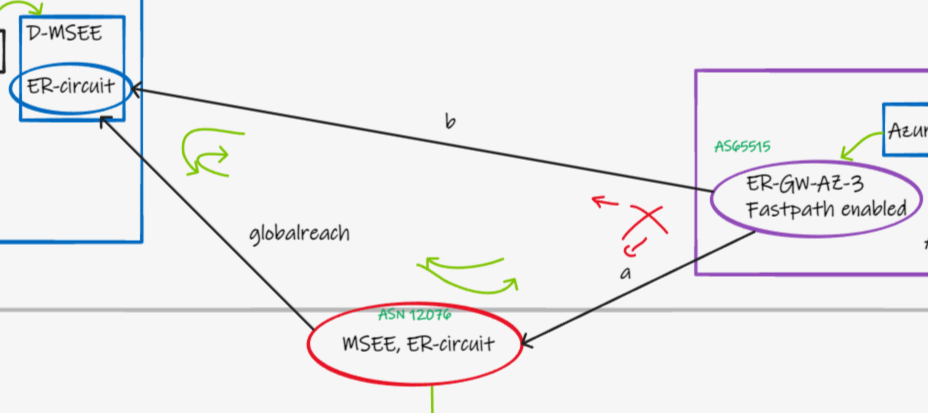

# Optimal routing between Azure VNet and Azure VMware Solution (AVS)

## Context

Today, AVS connects to the Azure VNet using a special implementation of ExpressRoute, entirely contained within the Azure Region. (ExpressRoute is more typically used for On-Premises connectivity). If you are completely new to AVS, checkout this document first - https://docs.microsoft.com/en-us/azure/azure-vmware/tutorial-expressroute-global-reach-private-cloud

> This logic could equally apply to other Azure dedicated offerings, such as Skytap, SAP HLI and Baremetal.

A typical (overly simplified) topology looks as below.


Let's consider the underlying BGP topology.

- [purple] Azure VNet contains ExpressRoute Gateway (BGP AS65515) (May or may not be using FastPath)
- [red] Microsoft Edge (MSEE) contains customer ExpressRoute circuit, used for regular On-Premises connectivity (BGP AS12076)
- [red] Customer routers, AS 65000 in this lab
- [blue] Microsoft Dedicated Edge (DMSEE) contains customer AVS ExpressRoute circuit, used for any connectivity in/out AVS (BGP AS12076)
- [blue] AVS infrastrucutre - SDDC etc, lots of hand waving here, but the ASN you see will be something like AS398656
- [connection a] The normal connection between MSEE and customer VNet (EBGP AS12076 to AS65515)
- [connection b] The connection used to optimally send traffic from AVS<>Azure VNet (without needing to via GlobalReach, this is often missed, but should always be configured) (EBGP AS12076 to AS65515)
- [globalreach] Used to allow On-Premises to access AVS (IBGP between AS12076 to AS12076)

## Do we have a routing loop?

Short answer is no. Whilst ER Circuits act as L3 routers between any associated connections, the ExpressRoute **Gateway** does not re-advertise routes. I.e.

- Routes from On-Prem are advertised from red to blue, and blue re-advertises to purple. So we _could_ have a functioning network without connection "a" but thats a bad idea
- Routes from On-Prem are advertised from red to purple, but purple does not re-advertise these to blue.



## How does the underlying routing logic ensure the most optimal path is used?

In the diagram, we clearly want traffic from purple to blue (VNet to AVS) and vice versa, to traverse directly. We do not want this traffic to pass via Red.

Similarly when red talks to purple, we do not want this traffic to pass via blue. (Even though it _could_).

To explain what is happening lets focus on purple to blue.

### ER Gateway Routing (VNet>AVS)

Let's take a look at how the ER Gateway sees the world.

```
EBgp      192.168.200.134  12076-398656                               32769     192.168.200.134
EBgp      192.168.200.135  12076-398656                               32769     192.168.200.135
EBgp      192.168.200.132  12076-12076-12076-398656                   32769     192.168.200.132
EBgp      192.168.200.133  12076-12076-12076-398656                   32769     192.168.200.133
```

It knows of several paths to a particular prefix that exists on AVS, however it prefers the one with **shortest as-path**. This happens to be the one with net-hop 192.168.200.134/135 in my lab, which under the covers is a next-hop that represents my "b" connection to AVS.

I.e. The additional AS hops added by utilising globalreach on the purple>red>blue route make this less preferred. As you would probably predict looking at the diagram to begin with.


> This as-path prepend happens when red circuit advertises the prefixes learnt via GlobalReach to Purple Gateway. It prepends them to represent the fact they've been learnt via GlobalReach, this makes the Gateway prefer the more Direct routes to AVS, without the prepend.

### ER Circuit (DMSEE) Routing (AVS>VNet)

Let's take a look how the blue circuit sees the world.

```
Network            NextHop           LocPrf    Weight    Path

192.168.200.0      10.0.0.129        10        0         65515
192.168.200.0      192.168.200.143             0         65515
192.168.200.0      192.168.200.141*            0         65515
```

(192.168.200.0/24 is my VNet prefix within the purple box)

When checking the primary connection we see 3 paths to the VNet prefix. One via GlobalReach (blue>red>purple) and 2 directly to my ER Gateway (blue>red). What is ensuring we take the optimal VNET route (blue>red) here? 

- Weight? No, equal
- LocalPref? You might think yes, but this is actual just a GUI apparition
- Origin? Same
- AS-Path? Equal
- Origin Code? Same
- MED? No
- eBGP routes are preferred over iBGP routes. This is our tie break. Remember that our purple VNET Gateway Peer is via EBGP to AS65515, whereas our red MSEE peer is IBGP to AS 12076. Therefore one of our VNET Gateway Routes (multiple nodes) is chosen, which one, or why, does not matter in this context.


# Summary

Purple and blue talk directly, in both directions (Symmetrically). You should always connect AVS designs in this triangular fashion (It is somewhat common to see customers skipping b, because it _will_ work without it at a functional level).

> NB. This is also the same logic as to why red and purple talk direct. And why AVS does not act as a hairpin for your regular onprem>vnet traffic.

tl;dr Standard BGP stuff under the covers, no need for customer tuning and the most optimal route is always used, ensuring you get the best latency and performance.

Jose Moreno talks more about this topic in the following great blogs:
- GlobalReach here https://blog.cloudtrooper.net/2021/12/21/expressroute-global-reach-under-the-covers/
- AVS voodoo here https://blog.cloudtrooper.net/2022/05/16/azure-vmware-solution-networking-voodoo/

# Bonus Gotcha (Interaction with multiple on-prem circuits)

Thanks to Daniel Mauser for pointing this one out, which makes a good addition here.

For customers running multiple on-premises ER circuits, they may be using weight (on the ER Connection object) to ensure that VNet to VNet traffic (often inter-region) utilises a specific Edge PoP. Explained further here - https://docs.microsoft.com/en-us/azure/expressroute/expressroute-optimize-routing#solution-assign-a-high-weight-to-local-connection

This use of weight introduces an additional consideration for us, as shown in the diagram below. With the following additions:

- Second on-prem ER circuit added (orange)
- Weight is being used to prefer the red ER connection


We have created ourselves a problem, because the use of Weight superseeds the as-path precedence as laid out in the section above. I.e. Even though the purple>red>blue route has a longer as-path, because the customer is using "Weight 200" on the "a" connection, this gets preferred.


The solution here is to ensure that "a" and "b" connection weights are the same, and therefore the BGP selection process will step down to as-path length to break the tie. (Whilst still allowing the use of the orange circuit for other VNet to VNet traffic that is dual homed to orange and red.


